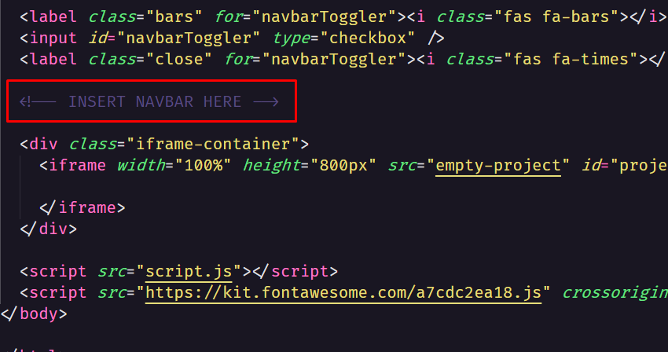

<h1 align="center">:rocket: Projetos com javascript</h1>

Repositório com códigos de projetos simples criados com, HTML, CSS, e JavaScript.

---

## Projetos

1. [Pedra, papel e tesoura](https://github.com/SkyG0D/projetos-js/tree/master/rock-paper-scissor).
2. [Calculadora básica](https://github.com/SkyG0D/projetos-js/tree/master/calculator).
3. [Carrosel de imagens](https://github.com/SkyG0D/projetos-js/tree/master/carousel).
4. [Cookies popup](https://github.com/SkyG0D/projetos-js/tree/master/cookies-popup).
5. [Jogo da Velha](https://github.com/SkyG0D/projetos-js/tree/master/tictactoe).
6. [Cronômetro](https://github.com/SkyG0D/projetos-js/tree/master/timer).
7. [Jogo Sequencial](https://github.com/SkyG0D/projetos-js/tree/master/sequential-game).
8. [Tabela HTML para .CSV](https://github.com/SkyG0D/projetos-js/tree/master/table-to-csv).
9. [Torre de Hanoi](https://github.com/SkyG0D/projetos-js/tree/master/tower-of-hanoi).
10. [Gerador de Senhas](https://github.com/SkyG0D/projetos-js/tree/master/password-generator).
11. [Efeito Matrix](https://github.com/SkyG0D/projetos-js/tree/master/matrix-effect).
12. [Bubble Sort](https://github.com/SkyG0D/projetos-js/tree/master/bubble-sort).

## Gerando lista de projetos dinamicamente

Para gerar uma lista de projetos no HTML dinamicamente, você pode usar o script `yarn start`. Para isso, no HTML, insira um comentário: *INSERT NAVBAR HERE*.

Exemplo:

Caso queira gerar a lista novamente, você precisará remover a lista anteriormente gerada, e executar o script novamente(lembre-se de inserir o comentário).
